<div align="center">

# LiteLLM Proxy on Render

**One metered, budget-enforced gateway in front of your Azure OpenAI deployments in Microsoft Foundry.**


</div>

---

## What this is

A **thin wrapper**. No LiteLLM source is vendored — the image is the official
`ghcr.io/berriai/litellm-database:v1.99.0`, pinned. This repo adds a Dockerfile,
a startup contract script, `config.yaml`, a Render Blueprint, and stdlib-only
operator scripts.

<table>
<tr><th align="left">Aliases</th><th align="left">Route</th><th align="left">Customer&nbsp;access</th></tr>
<tr>
<td><code>gpt-5.5</code><br><code>gpt-5.6-sol</code><br><code>gpt-5.6-terra</code><br><code>gpt-5.6-luna</code></td>
<td><code>azure/</code></td>
<td>🟢 <code>customer-models</code></td>
</tr>
<tr>
<td><code>gpt-6-astra</code></td>
<td><code>azure/gpt5_series/</code></td>
<td>🟢 <code>customer-models</code></td>
</tr>
</table>

All five resolve through `AZURE_OPENAI_API_BASE` on **one Foundry resource**,
through **one Entra service principal**, onto **one Azure invoice**. Customers see
one URL, one key, and a model list.

Three things that surprise people, all measured against the live resource:

| | |
| :-- | :-- |
| **No `api_version` is pinned** | v1.99.0 defaults to `2025-02-01-preview`. Override with `AZURE_API_VERSION`. There is no `AZURE_OPENAI_API_VERSION` variable here. |
| **No model accepts `temperature`** | All five are reasoning deployments. `temperature: 0.7` returns `400`; only the default `1` works. Use `reasoning_effort` (`low\|medium\|high`). |
| **Deployment names are yours** | The aliases above are defaults. They must match your Foundry deployment names character for character. |

> [!IMPORTANT]
> **`gpt5_series/` on `gpt-6-astra` is not a claim that it is a GPT-5 model.** It is
> LiteLLM's name for a *request-shaping path*: rename `max_tokens` to
> `max_completion_tokens`, allow `reasoning_effort`, refuse `temperature` — the
> contract GPT-6 also uses. The gate is a literal name test, identical in v1.99.0
> and the current v1.100.0, so upgrading does not remove the need for it:
>
> ```python
> return "gpt-5" in model or "gpt5_series" in model
> ```
>
> `"gpt-6-astra"` fails the first branch, leaving the second as the only way in.
> The prefix never reaches Azure — `transform_request` strips it before the
> deployment path is built, and the live response confirms it by reporting
> `model=gpt-6-astra-2026-09-03`. Remove it and every customer sending
> `max_tokens` gets a `400`.

---

## A. Architecture

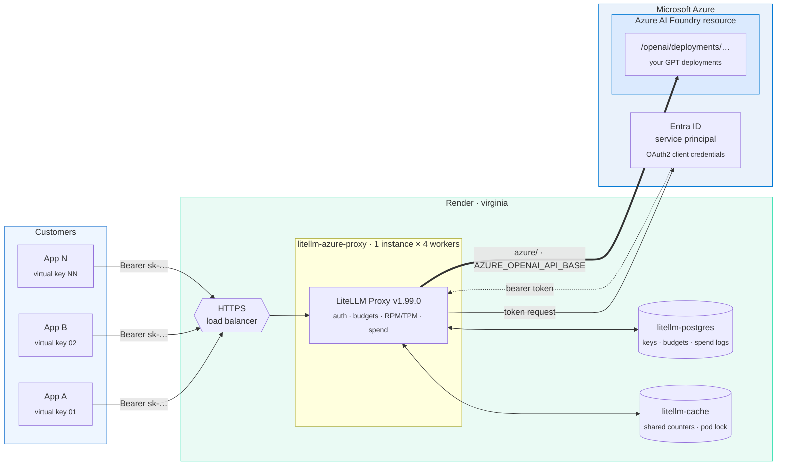

Two trust boundaries, and they never touch:

| Boundary | Credential | Held by |
| :-- | :-- | :-- |
| Customer → proxy | LiteLLM virtual key | the customer |
| Proxy → Azure | Entra client secret | the proxy only |

A virtual key is valid **nowhere except this proxy**. Customers never authenticate
to Azure and never learn the tenant, client id, secret or resource name. Entra ID
is authentication only, not private networking: Render calls the public Foundry
HTTPS endpoint over TLS.

---

## B. Access control: the group *is* the boundary

The most important design decision in the repo, and the one that changes if you
add providers.

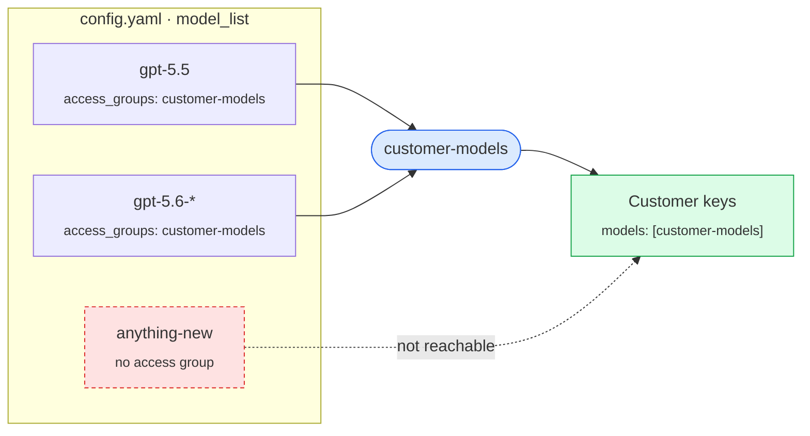

Customer keys are issued with `models: ["customer-models"]`, **never
`["all-proxy-models"]`**.

<table>
<tr><th align="left"></th><th align="left"><code>all-proxy-models</code></th><th align="left"><code>customer-models</code> group</th></tr>
<tr><td>New model added to config</td><td>🔴 instantly customer-visible</td><td>🟢 invisible until added to the group</td></tr>
<tr><td>Unverified / unpriced model</td><td>🔴 reachable</td><td>🟢 quarantined by default</td></tr>
<tr><td>Non-Azure provider added</td><td>🔴 every customer gets it</td><td>🟢 stays out unless grouped</td></tr>
<tr><td>Revoking one model</td><td>🔴 delete it from config</td><td>🟢 drop it from the group</td></tr>
</table>

> [!WARNING]
> `all-proxy-models` is a real LiteLLM sentinel that grants **every** model on the
> proxy, from **any** provider, forever. `create_virtual_keys.py` refuses to run if
> no model carries the `customer-models` group, and refuses if anything in the
> group is not Azure-backed (`azure/`).

---

## C. Microsoft Foundry preparation

<details>
<summary><b>1 · Deploy the models and read their real names</b></summary>

```bash
az cognitiveservices account deployment list \
  -n <resource-name> -g <resource-group> -o table
```

Rename the aliases in `config.yaml` to match the **Name** column. Nothing else in
the repo needs to change.

**One endpoint, and it is not the one Foundry shows first:**

| Portal field | Example | Used? |
| :-- | :-- | :-- |
| Azure OpenAI endpoint | `https://<resource>.openai.azure.com/openai/v1` | ✅ → `AZURE_OPENAI_API_BASE` |
| Project endpoint | `https://<resource>.services.ai.azure.com/api/projects/<project>` | ❌ addresses the projects/agents API, not inference |

> [!TIP]
> Paste the Azure OpenAI endpoint exactly as the portal shows it.
> `render_start.sh` strips the `/openai/v1` suffix and any trailing slash, because
> the `azure/` route builds `/openai/deployments/<name>/…` itself. It rejects a
> value carrying a deployment path or a query string.

</details>

<details>
<summary><b>2 · Prove a real invocation works</b></summary>

`Succeeded` proves provisioning, not usability:

```bash
TOKEN="$(az account get-access-token \
  --resource https://cognitiveservices.azure.com \
  --query accessToken -o tsv)"

curl -sS -X POST \
  "https://<resource>.openai.azure.com/openai/deployments/<deployment>/chat/completions?api-version=2025-02-01-preview" \
  -H "Authorization: Bearer ${TOKEN}" -H "content-type: application/json" \
  -d '{"messages":[{"role":"user","content":"Reply with OK."}],"max_completion_tokens":16}'
```

That is the exact path LiteLLM builds from `AZURE_OPENAI_API_BASE`, so a `200` with
content means the proxy will work too. Anything else is not proof.

</details>

<details>
<summary><b>3 · Recognise the quota-of-0 error</b></summary>

Pay-as-you-go deployments can be created with **0 RPM / 0 TPM** until a quota
increase is approved. The symptom is an immediate `429` (or quota `400`) on the
very first call, naming a rate limit, **with zero traffic**.

No LiteLLM setting works around this — no retry, no routing strategy and no key
limit creates capacity the provider has set to zero.

**Fix:** Azure portal → your resource → **Quotas** → select model and region →
request an increase → wait for approval → re-run step 2.

</details>

<details>
<summary><b>4 · One Entra service principal, least privilege</b></summary>

1. Entra ID → **App registrations** → **New registration**. Single tenant, no
   redirect URI.
2. **Certificates & secrets** → **New client secret**. Copy the **Value** column
   (not Secret ID) once, store it, diary the expiry.
3. Record the **tenant ID** and **client ID**.
4. On the resource (**resource scope, not subscription**) assign **Cognitive
   Services OpenAI User** — the role Microsoft documents as granting *"Make
   inference API calls with Microsoft Entra ID"*.

```bash
az role assignment create \
  --assignee <client-id> \
  --role "Cognitive Services OpenAI User" \
  --scope "/subscriptions/<sub>/resourceGroups/<rg>/providers/Microsoft.CognitiveServices/accounts/<resource>"
```

> [!WARNING]
> **Creating the app registration is not enough.** Without the role assignment the
> principal still receives a valid Entra token and Azure refuses the call itself:
> `401 Principal does not have access to API/Operation`. Do not mistake it for a
> bad secret or a wrong endpoint. `Cognitive Services Contributor` does **not**
> grant inference. Allow ~5 minutes to propagate.

> [!CAUTION]
> Never Owner, Contributor, User Access Administrator, a subscription or
> management-group scope, or any Entra directory role.

</details>

---

## D. Generate the proxy secrets

Run **twice**, keep the two values separate:

```bash
python -c "import secrets; print('sk-' + secrets.token_urlsafe(48))"
```

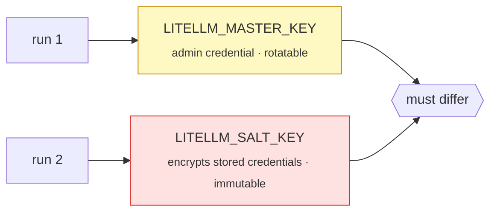

| Key | Rotate? | If you get it wrong |
| :-- | :-- | :-- |
| `LITELLM_MASTER_KEY` | ✅ set in Render, redeploy, update tooling | full admin compromise |
| `LITELLM_SALT_KEY` | ❌ **never after models exist** | stored provider credentials become undecryptable |

`render_start.sh` refuses to start if they match or if either lacks the `sk-`
prefix. The master key is also the Admin UI password (username `admin`).

---

## E. Deploy on Render

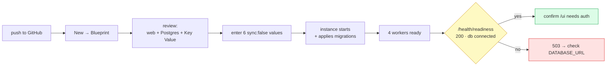

1. Push this repository to GitHub.
2. Render → **New** → **Blueprint** → connect the repo.
3. Review: one web service, one Postgres, one Key Value instance, all `virginia`.
4. Enter every `sync: false` value. Render prompts **only during initial Blueprint
   creation** — later updates do not re-prompt, so add new secrets by hand.
5. Deploy and watch the log for `render_start:` lines (variable **names** only).
6. Wait for `/health/readiness` → `200` with `"db": "connected"`.
7. Open `/ui` and confirm it demands admin auth. If it ever renders without a
   login, fix that before any customer key exists.

> [!NOTE]
> Schema migrations run at **proxy startup**, because `DISABLE_SCHEMA_UPDATE` is
> deliberately unset. That is why the service ships with `numInstances: 1` — two
> instances would race the same migration. Raise it later; see section L.

### Environment variables

<table>
<tr><th align="left">Entered by hand · <code>sync: false</code></th><th align="left">Value</th></tr>
<tr><td><code>LITELLM_MASTER_KEY</code></td><td><code>sk-…</code> run 1</td></tr>
<tr><td><code>LITELLM_SALT_KEY</code></td><td><code>sk-…</code> run 2, different</td></tr>
<tr><td><code>AZURE_OPENAI_API_BASE</code></td><td><code>https://&lt;resource&gt;.openai.azure.com</code><br><sub>the portal value with <code>/openai/v1</code> is accepted and normalised</sub></td></tr>
<tr><td><code>AZURE_TENANT_ID</code></td><td>Entra directory (tenant) ID</td></tr>
<tr><td><code>AZURE_CLIENT_ID</code></td><td>Entra application (client) ID</td></tr>
<tr><td><code>AZURE_CLIENT_SECRET</code></td><td>Entra client secret <b>Value</b></td></tr>
</table>

Six values, and **no Azure API key among them** — authentication is the Entra
service principal, so an `api-key` never exists on this deployment.

> [!CAUTION]
> Render does not delete a variable just because it left `render.yaml`. If an
> earlier deploy defined `AZURE_API_BASE`, `AZURE_OPENAI_API_VERSION` or
> `DISABLE_SCHEMA_UPDATE`, remove them by hand in the dashboard.

<table>
<tr><th align="left">Set by the Blueprint</th><th align="left">Value</th><th align="left">Why</th></tr>
<tr><td><code>DATABASE_URL</code></td><td>from <code>litellm-postgres</code></td><td>Postgres is mandatory</td></tr>
<tr><td><code>REDIS_URL</code></td><td>from <code>litellm-cache</code></td><td>shared counters across workers</td></tr>
<tr><td><code>PORT</code></td><td><code>4000</code></td><td>bound by the start script</td></tr>
<tr><td><code>LITELLM_NUM_WORKERS</code></td><td><code>4</code></td><td>one per vCPU</td></tr>
<tr><td><code>STORE_MODEL_IN_DB</code></td><td><code>True</code></td><td>DB-backed keys + Admin-UI model management</td></tr>
<tr><td><code>LITELLM_LOG</code></td><td><code>INFO</code></td><td>no verbose or debug logging</td></tr>
<tr><td><code>LITELLM_MODE</code></td><td><code>PRODUCTION</code></td><td>disables <code>load_dotenv</code></td></tr>
<tr><td><code>AZURE_SCOPE</code></td><td>documented default</td><td>not a secret</td></tr>
</table>

Locally: copy `.env.example` to `.env`. `.env` is git-ignored; `.env.example` is
tracked and holds placeholders only.

---

## F. Adding more models later

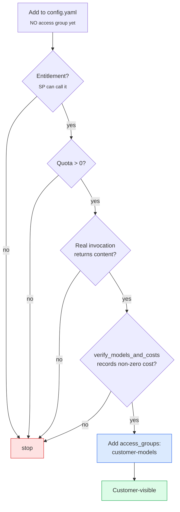

Every entry is the same shape. Copy one, change two lines:

```yaml
  - model_name: <public-alias>
    litellm_params:
      model: azure/<exact-foundry-deployment-name>
      api_base: os.environ/AZURE_OPENAI_API_BASE
      tenant_id: os.environ/AZURE_TENANT_ID
      client_id: os.environ/AZURE_CLIENT_ID
      client_secret: os.environ/AZURE_CLIENT_SECRET
      azure_scope: os.environ/AZURE_SCOPE
    model_info:
      mode: chat
      access_groups: ["customer-models"]
```

No `api_version` line: the image default `2025-02-01-preview` applies to every
model, and `AZURE_API_VERSION` overrides all of them at once.

Add the model **without** the access group, verify it, then add the group. That is
the whole reason the group exists.

> [!CAUTION]
> **OpenAI direct (`api.openai.com`) is a different decision.** It needs an
> `OPENAI_API_KEY` and arrives on a **separate OpenAI invoice**, breaking the
> single-bill property in section K. Keep it out of `customer-models` and give it
> its own group and keys so spend stays attributable per provider.

Chat models answer `/v1/chat/completions`; embedding, image, audio, rerank and
batch models do not. Set `model_info.mode` accordingly —
`verify_models_and_costs.py` skips non-chat modes with a warning rather than
guessing a route.

`STORE_MODEL_IN_DB=True` also allows adding models from the Admin UI without a
redeploy. UI-added models carry a `database` badge, config models carry `config`;
pick one source of truth per model. A UI-added model still needs the access group.

---

## G. One key per customer: selected models + own hard budget

Each customer gets their own key, their own model selection, and their own hard
budget. Access is two-layered, and both layers deny by default:

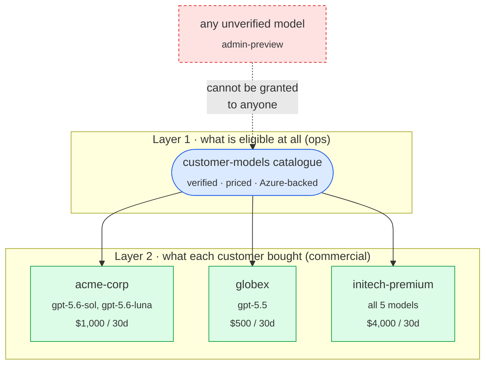

### Define your customers

Copy `customer-profiles.example.json`. Real profiles are git-ignored
(`customer-profiles.json`); only the example is tracked.

```json
[
  {
    "key_alias": "acme-corp",
    "models": ["gpt-5.6-sol", "gpt-5.6-luna"],
    "max_budget": 1000,
    "budget_duration": "30d",
    "rpm_limit": 300,
    "tpm_limit": 1000000,
    "max_parallel_requests": 15
  },
  {
    "key_alias": "hooli-everything",
    "models": ["customer-models"],
    "max_budget": 2500,
    "budget_duration": "30d",
    "rpm_limit": 600,
    "tpm_limit": 2000000,
    "max_parallel_requests": 25
  }
]
```

All seven fields are **required on every profile**. Naming `"customer-models"` in
`models` means "the whole catalogue as it stands" — the one case where a later
catalogue addition does reach that key.

> [!IMPORTANT]
> **Unknown fields are rejected, not ignored.** A profile containing `max_budgett`
> fails loudly instead of creating a key with **no budget at all**. That single
> typo is the most expensive mistake available here.

### Issue the keys

```bash
export LITELLM_BASE_URL="https://litellm-azure-proxy.onrender.com"
export LITELLM_MASTER_KEY="sk-…"      # never printed by the script

python scripts/create_virtual_keys.py \
  --profiles customer-profiles.json \
  --output generated-keys.json
```

```
preflight: readiness ok, database connected
preflight: /v1/models exposes 5 models, every expected alias present
preflight: 5 model(s) in 'customer-models', all Azure-backed; 0 configured model(s) stay hidden
created: acme-corp        <key ending V6jQ>
created: globex           <key ending BqkQ>
```

`--dry-run` previews with no network calls and no keys. A profile naming a model
outside the catalogue stops the whole run, naming the customer:

```
error: Refusing to issue keys. These profiles request models that are not in the
'customer-models' catalogue:
  acme-corp -> this-model-is-not-configured
Eligible models: gpt-5.5, gpt-5.6-luna, gpt-5.6-sol, gpt-5.6-terra, gpt-6-astra
```

Nothing is issued unless every step passes:

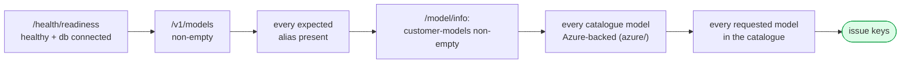

<details>
<summary><b>Uniform mode, if every customer gets the same thing</b></summary>

```bash
python scripts/create_virtual_keys.py \
  --count 5 --budget 2000 --budget-duration 30d \
  --rpm 600 --tpm 2000000 --max-parallel 25
```

Creates `customer-01…05`, each granted the whole catalogue. `--rpm`, `--tpm` and
`--max-parallel` have no defaults on purpose: choose them against your real
Foundry quota. Zero, negative, `NaN` and non-numeric values are rejected before
any network call.

</details>

> [!WARNING]
> **`30d` is a rolling 30-day window, not a calendar month.** LiteLLM's
> `budget_duration` units are seconds, minutes, hours and days — there is no month
> unit. A key created on the 14th resets on the 13th of the next month. If you
> invoice on calendar months, accept the drift or reset spend yourself.

`key_alias` must be globally unique: re-running with the same profile file fails on
the first duplicate rather than creating a second key. To rotate a customer's key
use `/key/regenerate` (SECURITY.md), not a second create.

> [!WARNING]
> A virtual key value is shown once. `generated-keys.json` is the only copy,
> written with owner-only permissions. Move it into your secret store, hand each
> customer only their own key, then delete the local file. It is git-ignored.

Budgets are per key, not a shared pool: one customer cannot consume another's, and
nothing caps the *total*. Sum the profiles yourself to know your aggregate
exposure.

### Verified behaviour

Every alias called for real against the Foundry resource. Each answered as itself,
with a distinct model id and a distinct recorded cost:

| Requested | HTTP | Response `.model` | Recorded cost (USD) |
| :-- | :-- | :-- | :-- |
| `gpt-5.5` | `200` | `gpt-5.5` | `0.000515` |
| `gpt-5.6-sol` | `200` | `gpt-5.6-sol` | `0.000215` |
| `gpt-5.6-terra` | `200` | `gpt-5.6-terra` | `0.000086` |
| `gpt-5.6-luna` | `200` | `gpt-5.6-luna` | `0.0000086` |
| `gpt-6-astra` | `200` | `gpt-6-astra` | `0.00033` |

Five distinct `x-litellm-model-id` values and five distinct price points confirm
five separate deployments: a request is served by the deployment it named, never
substituted. Non-zero costs on all five are what make the USD budgets real.

Enforcement, measured against the built image on real Postgres 16 and Redis 7:

| Test | Result |
| :-- | :-- |
| `/health/readiness` after cold start | `200` `{"status":"healthy","db":"connected"}` in ~45 s, 83 tables created by the startup migration |
| `AZURE_OPENAI_API_BASE` set to the portal's `…/openai/v1` | `render_start: ok: AZURE_OPENAI_API_BASE normalised to the resource endpoint` |
| every alias → its own deployment | asked for `gpt-6-astra`, routed `Received Model Group=gpt-6-astra`, `Available Model Group Fallbacks=None` |
| an unconfigured alias | `400 Invalid model name passed in model=gpt-5.6` — refused, never substituted |
| `acme-corp` key → `GET /v1/models` | 2 models: `gpt-5.6-sol`, `gpt-5.6-luna` |
| `acme-corp` key → `gpt-5.5` | `403 key_model_access_denied` — *This key can only access models=['gpt-5.6-sol', 'gpt-5.6-luna']. Tried to access gpt-5.5* |
| `globex` key → `gpt-5.6-sol` | `403 key_model_access_denied` — *…can only access models=['gpt-5.5']* |
| spend $5.00 vs `max_budget` $1.00 | **`429 budget_exceeded`** — *Budget has been exceeded! Current cost: 5.0, Max budget: 1.0* |

The `403` and `429` paths need no Azure credentials: the proxy refuses before it
would call a provider, which is the property that matters.

<details>
<summary><b>Why <code>gpt-6-astra</code> carries a routing prefix — one request per row</b></summary>

| Model string sent to LiteLLM | Params | Result |
| :-- | :-- | :-- |
| `azure/gpt-6-astra` | `max_tokens` | `400` — *'max_tokens' is not supported with this model* |
| `azure/gpt5_series/gpt-6-astra` | `max_tokens` | `200`, served by `gpt-6-astra-2026-09-03` |
| `azure/gpt5_series/gpt-6-astra` | `max_completion_tokens` | `200` |
| `azure/gpt5_series/gpt-6-astra` | `max_tokens` + `reasoning_effort` | `200` |
| `azure/gpt5_series/gpt-6-astra` | `max_tokens` + `temperature: 0.7` | `400` — temperature |
| `azure/gpt-5.6-sol` | `max_tokens` + `temperature: 0.7` | `400` — temperature |
| `azure/gpt-5.5` | `max_tokens` + `temperature: 0.7` | `400` — temperature |

The response reporting `gpt-6-astra-2026-09-03` proves the prefix does not leak
into the deployment path. The last three rows are why `gpt-6-astra` is **not** a
special case: `temperature` is refused by every model here, so with the prefix in
place it behaves exactly like the `gpt-5.6` series.

</details>

Then verify with a customer key:

```bash
export LITELLM_API_KEY="sk-…"
python scripts/smoke_test.py
python scripts/verify_models_and_costs.py    # uses LITELLM_MASTER_KEY
```

---

## H. What customers do

Three things: the proxy URL, their key, the alias list from `GET /v1/models`.
Never the master key, never anything about Azure. The proxy speaks the OpenAI API,
so any OpenAI SDK works by changing `base_url` and `api_key`.

```bash
curl -sS $URL/v1/chat/completions \
  -H "Authorization: Bearer $CUSTOMER_KEY" -H "content-type: application/json" \
  -d '{"model":"gpt-5.6-sol",
       "messages":[{"role":"user","content":"Summarise this in one line."}],
       "max_completion_tokens":256}'
```

```python
from openai import OpenAI

client = OpenAI(base_url=f"{URL}/v1", api_key=CUSTOMER_KEY)
print(client.chat.completions.create(
    model="gpt-5.6-sol",
    messages=[{"role": "user", "content": "Reply with OK."}],
    max_completion_tokens=16,
).choices[0].message.content)
```

Switching models changes only the `model` field:

```bash
for M in gpt-5.5 gpt-5.6-sol gpt-5.6-terra gpt-5.6-luna gpt-6-astra; do
  curl -sS $URL/v1/chat/completions \
    -H "Authorization: Bearer $CUSTOMER_KEY" -H "content-type: application/json" \
    -d "{\"model\":\"$M\",\"messages\":[{\"role\":\"user\",\"content\":\"Reply with OK.\"}],\"max_completion_tokens\":16}"
done
```

Every request on a key counts against **that key's single budget**, whichever
model it names.

---

## I. Hard-stop behaviour

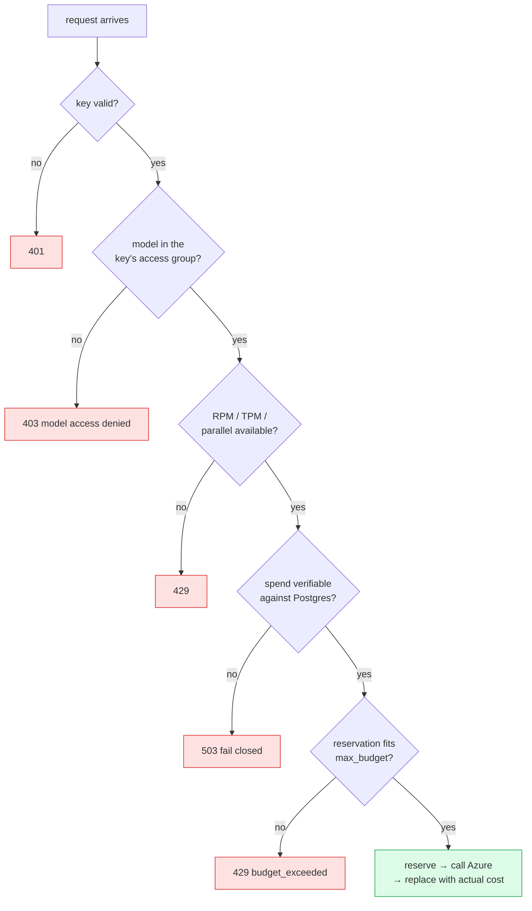

- **Postgres is mandatory.** `/health/readiness` returns `503` when it is
  unreachable, so Render pulls the instance out of rotation.
- **`fail_closed_budget_enforcement: true`** — if spend can be verified against
  neither Redis nor Postgres the request is **rejected**, not admitted on an
  unverifiable budget.
- **Reservation stays on** (`disable_budget_reservation: false`). Estimated maximum
  cost is held before the request reaches Azure, so concurrent requests cannot
  share the last dollar.
- **An exhausted key is blocked on every model it holds.** The budget lives on the
  key, not the model.
- **No fallbacks** of any kind, and no model priced at zero — LiteLLM skips budget
  checks entirely for zero-priced models, which would be a free bypass for an
  exhausted key. A refused request fails with its reason and is never rerouted.
- **Access resumes** when the `budget_duration` window resets, or when an admin
  raises the key's limits.

Tell customers that `429` with `"type": "budget_exceeded"` means "quota exhausted
until the window resets", distinct from an RPM/TPM `429` that clears in seconds.

> [!NOTE]
> **A small overage is possible.** Output-token cost is unknown until a generation
> finishes, so an in-flight request can push a key slightly past its budget.
> Reservation and bounded parallelism keep the window small. The guarantee is *no
> new request is admitted once the budget is exhausted* — not a cent-exact
> cut-off. Do not promise one.

Prove it with `scripts/test_limits.py` — manual, interactive, never in CI, and it
spends real money.

---

## J. Pricing verification

USD budgets are only as good as the per-model price LiteLLM uses.

```bash
python scripts/verify_models_and_costs.py
```

Per model it checks the mapped input/output price, sends the smallest valid
request for that model type, then reads the recorded cost from the
`x-litellm-response-cost` header **and** `GET /spend/logs?request_id=…`. Zero,
null, missing or unknown cost is a failure.

| ⚠️ | Rule |
| :-- | :-- |
| 🔴 | **Never expose a model with unknown or zero cost.** Zero isn't just mispriced — budget checks are skipped entirely. |
| 🔴 | Use **only official Microsoft/Azure pricing**. Not OpenAI's direct rates, not a blog post. |
| 🟡 | Cached-input, standard input, batch and output rates are **different numbers**. Confirm each separately. |
| 🟢 | A model that fails here can stay configured — just keep it out of `customer-models`. |

To override a price, add to `model_info`:

```yaml
      input_cost_per_token: 0.0000xx     # official Azure price
      output_cost_per_token: 0.0000yy    # official Azure price
```

---

## K. Billing

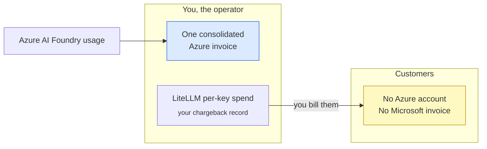

All usage authenticates as one service principal against one subscription, so
every model lands on **one Azure invoice addressed to you**. LiteLLM meters per
virtual key; that is your chargeback data. Customers receive nothing from
Microsoft — **you must bill them**.

Reconcile LiteLLM spend against the Azure invoice regularly. They can diverge:
mapped pricing may drift from your contract, and failed requests, batch jobs and
cached-input traffic can be accounted differently on each side.

---

## L. Scale and concurrency

Concurrency is a **configuration** question far more often than a capacity one.
Proxying an LLM call is I/O-bound — the request spends nearly all its life
awaiting Azure.

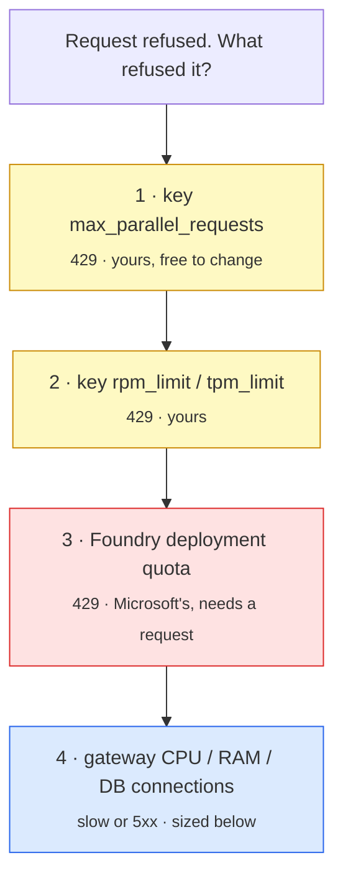

Items 1–3 return `429`. Only item 4 looks like a slow or failing proxy.

### `max_parallel_requests` is per key, not per proxy

| How callers are grouped | `--max-parallel` | Aggregate in flight |
| :-- | :-- | :-- |
| N concurrent spread across 5 customers | `N / 5` | N |
| Each of 5 customers may run N at once | `N` | 5 × N |
| N end users behind **one** key | `N` on that key | N |

If 20 end users share one virtual key with `--max-parallel 4`, sixteen get `429`
no matter how large the Render plan is. The key limit fixes that, not the
infrastructure.

### Current sizing

| Component | Plan | Capacity note |
| :-- | :-- | :-- |
| Web service | `4c-16g` × 1 instance | 4 workers. LiteLLM documents 1 vCPU **and 4 GB per worker**; 4 GB is a floor — the Prisma query engine's resident memory is a high-water mark set by its largest-ever spend write, so an under-provisioned instance is OOM-killed by one big write. |
| Postgres | `4c-16g` | LiteLLM's documented row for up to **1K sustained RPS**; 400 connection ceiling. |
| Key Value | `1g`, private only | Shared rate-limit counters, budget reservations, cache invalidation, job lock. |
| DB pool | `20` per worker | 20 × 4 × 1 = **80** of 400, leaving room to raise `numInstances`. Connections fail before database CPU does. |
| `request_timeout` | `600` | The default 6000 s would pin a slot for over an hour. |
| `maxShutdownDelaySeconds` | `120` | In-flight generations drain on redeploy instead of being SIGKILLed at 30 s. |

> [!IMPORTANT]
> **Redis is not optional above one worker.** Without it every worker keeps its own
> counters and reservations, so a key's effective limits multiply by the worker
> count (4× here) and the hard budget stops being hard. `render_start.sh`
> **refuses to start** with `LITELLM_NUM_WORKERS > 1` unless `REDIS_URL` or
> `REDIS_HOST` is set. The env var alone is not enough — `config.yaml` must point
> at Redis too, which it does.

Two generic production recommendations deliberately **not** applied:
`proxy_batch_write_at: 60` (for the ~1000 RPS range; below it the tighter default
keeps the database `fail_closed_budget_enforcement` reads closer to real time) and
`disable_error_logs: True` (trades audit evidence for table size).

### Prove it, don't assume it

```bash
# Free: N simultaneous authenticated reads. No Azure call, no cost.
python scripts/concurrency_check.py --concurrency 50

# Billable: N simultaneous real completions, subject to every limit above.
python scripts/concurrency_check.py --concurrency 50 --rounds 1 \
  --generate --i-understand-this-spends-money
```

Reports served / throttled / failed plus p50, p95 and max latency per round. Exits
non-zero on any `429`, and in `--generate` mode says whether the limit is the key
or the quota. Refuses `--generate` when `CI`/`GITHUB_ACTIONS` is set.

### Scaling further

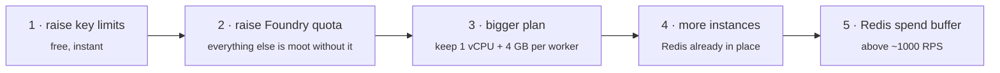

Raising `numInstances` raises DB connections by `pool × workers`. Keep
`pool × workers × instances` under the connection ceiling — the test suite asserts
this.

**Going from 1 instance to 2+:** deploy with `numInstances: 1` and let it create
the schema, confirm `"db": "connected"`, then raise `numInstances` — steady-state
deploys have no pending migrations, so the startup migration is a no-op and the
race is harmless. On a LiteLLM version bump, when migrations *are* pending, drop
back to 1 instance for that deploy, or move migrations to a one-off job and set
`DISABLE_SCHEMA_UPDATE=true`.

---

## M. Limitations

- **Postgres is required**, on a paid persistent plan. Back it up and test a
  restore: it holds every key, budget and spend record — your billing evidence.
- **Pin and test upgrades.** Bump `LITELLM_VERSION`, read the release notes, deploy
  to a non-production service, re-run `smoke_test.py`,
  `verify_models_and_costs.py`, `concurrency_check.py` and `test_limits.py`, then
  promote. Never track `latest` or `main-stable`.
- **Set a spend-log retention period.** `LiteLLM_SpendLogs` grows without bound;
  storage, not CPU, is what you resize first.
- **Monitor** Render health and deploys, LiteLLM spend and budget metrics, Postgres
  connection count against `max_connections`, and Azure `429`s (usually quota).
- **Overage is possible on in-flight generations** (section I).
- **One resource, one credential.** If you add a provider outside this Azure
  resource, re-read section F — the access group is what keeps that decision from
  silently reaching every customer.
- **Alias names must match your deployments**, or the proxy starts and enforces
  budgets correctly while every model call returns deployment-not-found.

---

## Repository layout

```
.
├── Dockerfile                        pinned image + startup contract
├── config.yaml                       models, access groups, budgets, Redis
├── render.yaml                       web + Postgres + Key Value Blueprint
├── customer-profiles.example.json    per-customer models + budgets template
├── .env.example                      placeholders only
├── .github/workflows/ci.yml
├── scripts/
│   ├── common.py                     stdlib helpers, redaction, validation
│   ├── concurrency_check.py          prove N concurrent callers
│   ├── create_virtual_keys.py        issue customer keys + preflight
│   ├── render_start.sh               validate env, then exec litellm
│   ├── smoke_test.py                 post-deploy checks with a customer key
│   ├── test_limits.py                manual budget / RPM / TPM proof
│   └── verify_models_and_costs.py    per-model cost gate
└── tests/
    ├── test_deployment_contract.py   pins every reviewed setting
    └── test_key_creation.py          mocked HTTP, secret hygiene
```

## Local checks

```bash
python -m pip install pytest pyyaml
python -m compileall -q scripts tests
python -m pytest -q
sh -n scripts/render_start.sh
docker build --build-arg LITELLM_VERSION=v1.99.0 -t litellm-azure-proxy:local .
```

CI runs the same checks on every push and PR, plus a committed-secret scan and a
`generated-keys.json` tracking check. **No Azure calls, no paid model calls.**

## Known deviations from the original brief

<details>
<summary><b>Seven documented deviations, with reasons</b></summary>

1. **Render plan names.** `plan: standard` and `plan: basic-1gb` are not valid
   Blueprint values; the spec documents compute **plan IDs**. Sized for real
   concurrency: `4c-16g` web, `4c-16g` Postgres, `1g` Key Value.
2. **`all-proxy-models` replaced by an access group**, which would make any newly
   configured model instantly customer-visible. Strictly more restrictive, same
   customer experience.
3. **Claude removed entirely.** This Azure resource does not offer it, so
   `azure_ai/`, `AZURE_API_BASE` and the `/v1/messages` route are gone rather than
   left as configuration that cannot work. `AZURE_PREFIXES` still accepts
   `azure_ai/` so a future non-OpenAI Foundry model needs no code change.
4. **Aliases were guesses** until reconciled against the live resource. All five
   are now confirmed, and `gpt-6-astra` sits in `customer-models` with the rest
   because the `gpt5_series/` prefix makes its request handling identical.
5. **Entrypoint override**, so the deployment contract is validated before the
   CLI starts. Migrations stay at proxy startup: `preDeployCommand` exited `128`
   with no output, most likely because it passes through the overridden
   `ENTRYPOINT`.
6. **No `api_version` anywhere.** v1.99.0 ships
   `AZURE_DEFAULT_API_VERSION = 2025-02-01-preview`, verified inside the pinned
   image, so `AZURE_OPENAI_API_VERSION` was dropped and `AZURE_API_VERSION`
   remains as the documented override.
7. **No `USER` line.** The pinned `litellm-database` image defines no non-root
   user, and forcing an arbitrary UID breaks the startup migration. The non-root
   variant is a separate image (`litellm-non_root`) without Prisma.

</details>

---

<div align="center">

**Read [SECURITY.md](SECURITY.md) before handing out a single key.**

</div>
