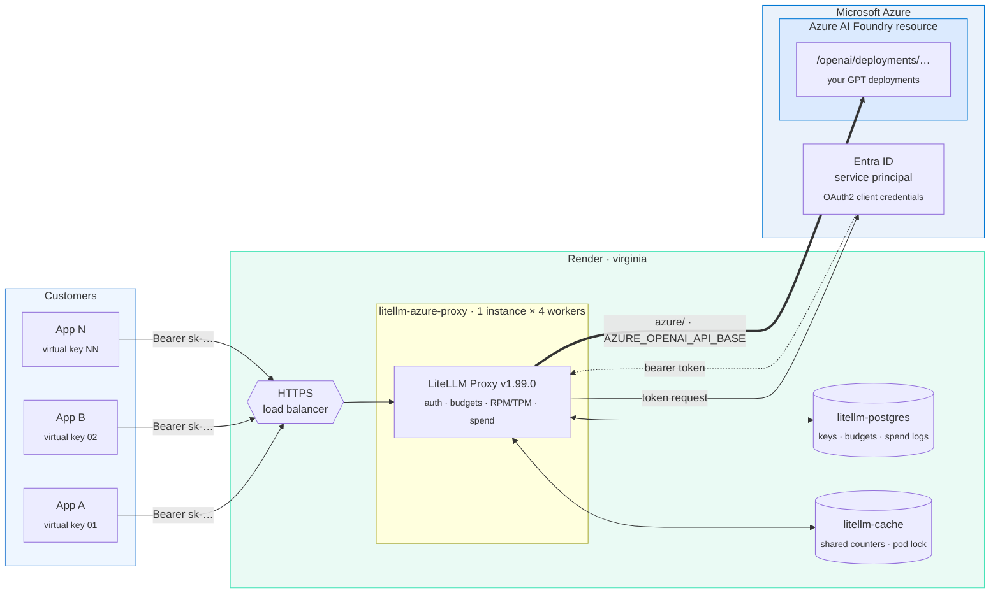
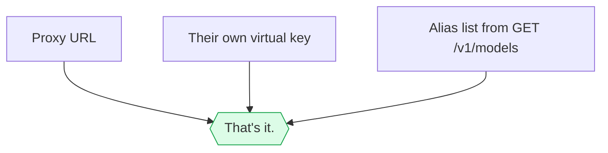
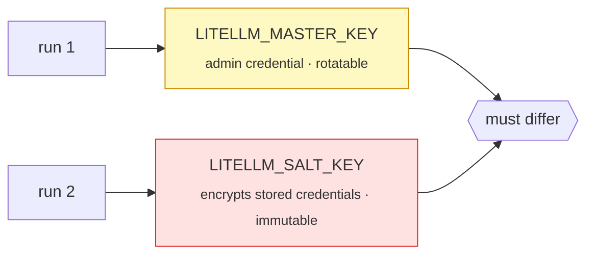
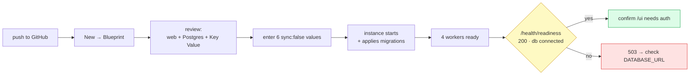
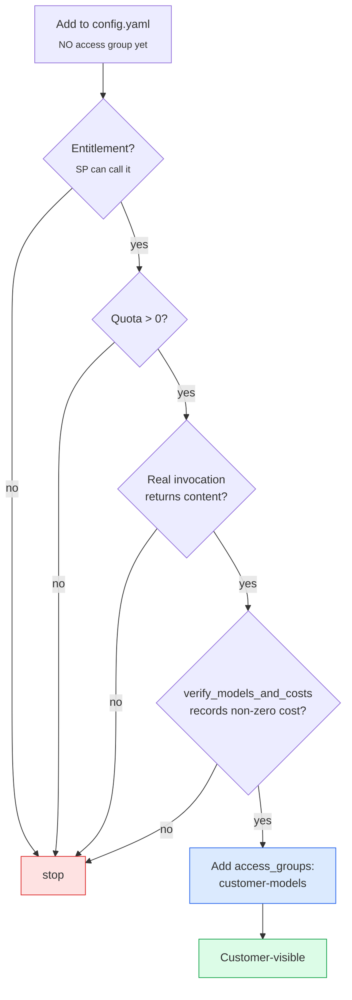
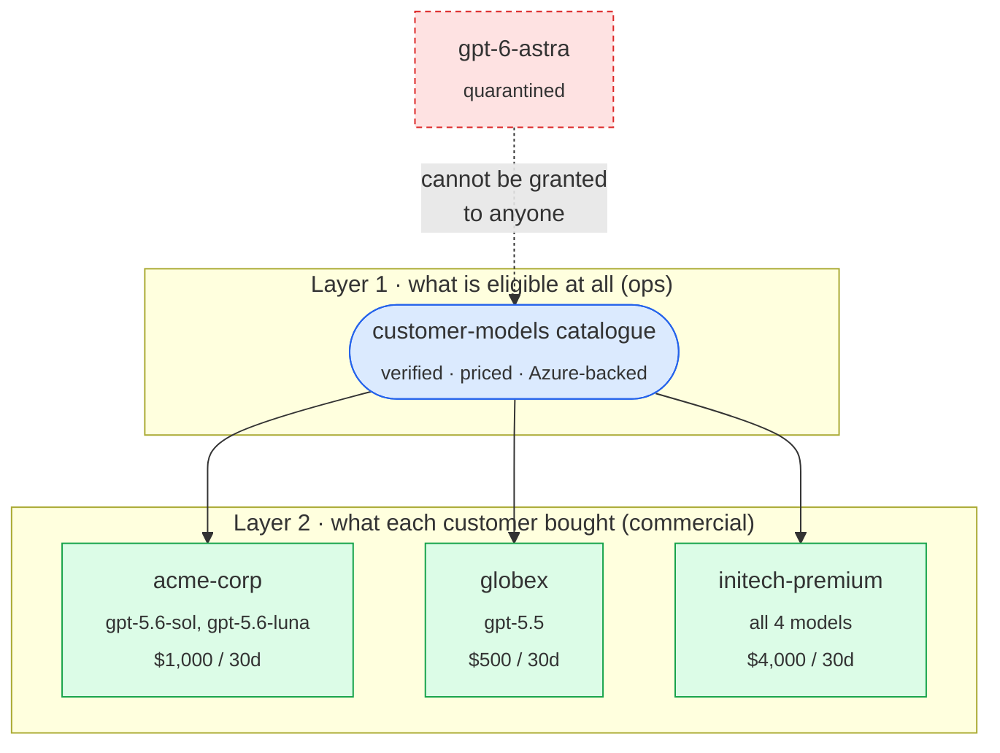
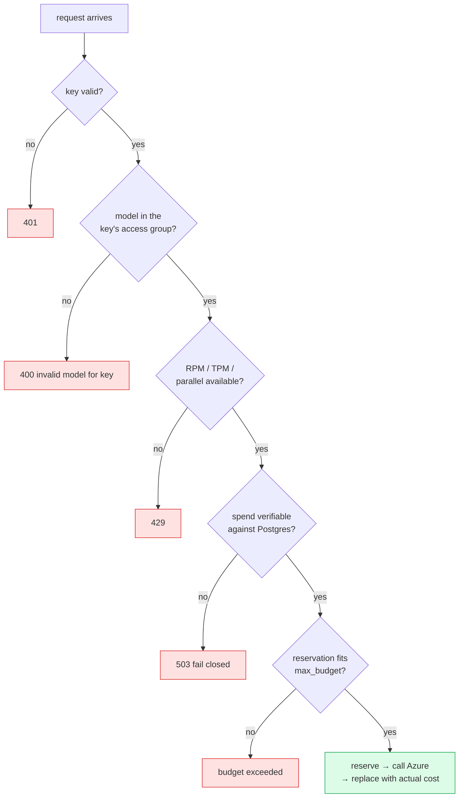
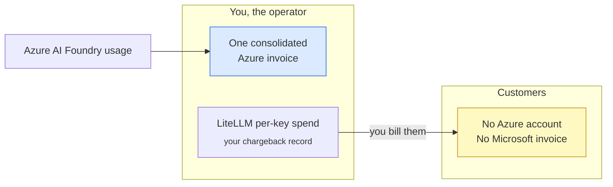
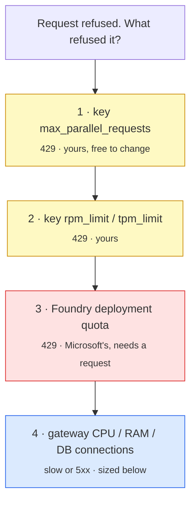
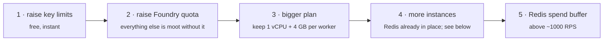

<div align="center">

# LiteLLM Proxy on Render

**One metered, budget-enforced gateway in front of your Azure OpenAI deployments in Microsoft Foundry.**


</div>

---

## What this is

A **thin wrapper**. No LiteLLM source is vendored — the image is the official
`ghcr.io/berriai/litellm-database:v1.99.0`, pinned. This repo adds a Dockerfile,
a startup contract script, `config.yaml`, a Render Blueprint, and stdlib-only
operator scripts.

<table>
<tr><th align="left">Aliases</th><th align="left">Route</th><th align="left">Endpoint</th><th align="left">Customer&nbsp;access</th></tr>
<tr>
<td><code>gpt-5.5</code><br><code>gpt-5.6-sol</code><br><code>gpt-5.6-terra</code><br><code>gpt-5.6-luna</code></td>
<td><code>azure/</code></td>
<td><code>AZURE_OPENAI_API_BASE</code><br><sub>…openai.azure.com</sub></td>
<td>🟢 <code>customer-models</code></td>
</tr>
<tr>
<td><code>gpt-6-astra</code></td>
<td><code>azure/</code></td>
<td><code>AZURE_OPENAI_API_BASE</code></td>
<td>🟡 <code>admin-preview</code></td>
</tr>
</table>

Every model runs on **one Foundry resource**, through **one Entra service
principal**, onto **one Azure invoice**. Customers see one URL, one key, and a
model list.

> [!NOTE]
> **No `api_version` is pinned.** LiteLLM v1.99.0 defaults Azure OpenAI calls to
> `2025-02-01-preview`. Set the documented `AZURE_API_VERSION` env var only if you
> need a different one — there is no `AZURE_OPENAI_API_VERSION` variable here.

> [!WARNING]
> **`gpt-6-astra` is configured but quarantined on v1.99.0.** LiteLLM's GPT-5
> reasoning classifier matches `gpt-5*` names only, so on this pinned version a
> `gpt-6-astra` request keeps `max_tokens` and `temperature` as sent and the
> provider **rejects them**. The widened classifier ships after v1.99.0. Until
> you bump `LITELLM_VERSION`, callers must send `max_completion_tokens` and omit
> `temperature`; it accepts `reasoning_effort` `low|medium|high|xhigh`. Cost
> tracking already works — `POST /reload/model_cost_map` pulls its pricing.
> Promote it by changing its `access_groups` to `["customer-models"]` **after**
> upgrading and re-running `verify_models_and_costs.py`.

> [!IMPORTANT]
> Deployment names are operator-chosen in Foundry. The names above are defaults.
> Rename `model_name` / `model` in `config.yaml` to match yours, and let
> `scripts/verify_models_and_costs.py` be the gate before any customer sees them.

---

## A. Architecture



Two trust boundaries, and they never touch:

| Boundary | Credential | Held by |
| :-- | :-- | :-- |
| Customer → proxy | LiteLLM virtual key | the customer |
| Proxy → Azure | Entra client secret | the proxy only |

A virtual key is valid **nowhere except this proxy**. Customers never
authenticate to Azure, and never learn the tenant, client id, secret or resource
name. Entra ID here is authentication only — not private networking. Render calls
the public Foundry HTTPS endpoint over TLS.

### What a customer receives



---

## B. Access control: the group *is* the boundary

This is the most important design decision in the repo, and the one that changes
if you add providers.


Customer keys are issued with `models: ["customer-models"]`, **never
`["all-proxy-models"]`**.

<table>
<tr><th align="left"></th><th align="left"><code>all-proxy-models</code></th><th align="left"><code>customer-models</code> group</th></tr>
<tr><td>New model added to config</td><td>🔴 instantly customer-visible</td><td>🟢 invisible until added to the group</td></tr>
<tr><td>Unverified / unpriced model</td><td>🔴 reachable</td><td>🟢 quarantined by default</td></tr>
<tr><td>Non-Azure provider added</td><td>🔴 every customer gets it</td><td>🟢 stays out unless grouped</td></tr>
<tr><td>Revoking one model</td><td>🔴 delete it from config</td><td>🟢 drop it from the group</td></tr>
</table>

> [!WARNING]
> `all-proxy-models` is a real LiteLLM sentinel and it does exactly what it says:
> grants **every** model on the proxy, from **any** provider, forever. It is
> deliberately unused on customer keys here. `scripts/create_virtual_keys.py`
> refuses to run if no model carries the `customer-models` group, and refuses if
> anything in the group is not Azure-backed (`azure/`).

---

## C. Microsoft Foundry preparation

<details>
<summary><b>1 · Deploy the models</b></summary>

Deploy (or confirm) each GPT model you intend to expose, then list the real
deployment names — the string after `azure/` in `config.yaml` must match
character for character:

```bash
az cognitiveservices account deployment list \
  -n <resource-name> -g <resource-group> -o table
```

Rename the aliases in `config.yaml` to match. Nothing else in the repo needs to
change.

**One endpoint, and it is not the one Foundry shows first.** The portal offers two
values; only the Azure OpenAI one is used here.

| Portal field | Example | Used? |
| :-- | :-- | :-- |
| Azure OpenAI endpoint | `https://<resource>.openai.azure.com/openai/v1` | ✅ → `AZURE_OPENAI_API_BASE` |
| Project endpoint | `https://<resource>.services.ai.azure.com/api/projects/<project>` | ❌ not used |

The project endpoint addresses the Foundry **projects/agents** API, not model
inference. Pasting it here fails with a named error.

> [!TIP]
> Paste the Azure OpenAI endpoint exactly as the portal shows it.
> `render_start.sh` strips the `/openai/v1` suffix and any trailing slash for you,
> because the `azure/` route builds `/openai/deployments/<name>/…` itself. What it
> rejects is a value carrying a deployment path or a query string.

</details>

<details>
<summary><b>2 · Prove a real invocation works</b></summary>

`Succeeded` proves provisioning, not usability. Prove it with a real call:

```bash
TOKEN="$(az account get-access-token \
  --resource https://cognitiveservices.azure.com \
  --query accessToken -o tsv)"

curl -sS -X POST \
  "https://<resource>.openai.azure.com/openai/deployments/<deployment>/chat/completions?api-version=2025-02-01-preview" \
  -H "Authorization: Bearer ${TOKEN}" \
  -H "content-type: application/json" \
  -d '{"messages":[{"role":"user","content":"Reply with OK."}],"max_tokens":16}'
```

This is the exact path LiteLLM builds from `AZURE_OPENAI_API_BASE`, so a `200`
here means the proxy will work too.

A `200` with content is proof. Anything else is not.

</details>

<details>
<summary><b>3 · Recognise the quota-of-0 error</b></summary>

Pay-as-you-go deployments can be created with **0 RPM / 0 input TPM / 0 output
TPM** until a quota increase is approved. The symptom is an immediate `429` (or a
quota `400`) on the very first call, naming a rate or tokens-per-minute limit,
**with zero traffic**.

No LiteLLM setting can work around this. No retry, no routing strategy and no key
limit creates capacity the provider has set to zero.

**Fix:** Azure portal → your Foundry resource → **Quotas** (or Foundry portal →
Management centre → Quota) → select model and region → request an increase →
wait for approval → re-run step 2.

</details>

<details>
<summary><b>4 · One Entra service principal, least privilege</b></summary>

1. Entra ID → **App registrations** → **New registration**. Single tenant, no
   redirect URI.
2. **Certificates & secrets** → **New client secret**. Copy once, store in your
   secret manager, diary the expiry.
3. Record the **tenant ID** and **client ID**.
4. On the **Foundry resource** (resource scope, not subscription), assign
   **Cognitive Services OpenAI User**. That is the role Microsoft documents as
   granting *"Make inference API calls with Microsoft Entra ID"*.

```bash
az role assignment create \
  --assignee <client-id> \
  --role "Cognitive Services OpenAI User" \
  --scope "/subscriptions/<sub>/resourceGroups/<rg>/providers/Microsoft.CognitiveServices/accounts/<resource>"
```

> [!WARNING]
> **Creating the app registration is not enough.** Without this role assignment
> the service principal still receives a valid Entra token, and Azure then
> refuses the call itself: `401 Principal does not have access to
> API/Operation`. Do not confuse it with a bad secret or a wrong endpoint.
> `Cognitive Services Contributor` does **not** grant inference — Microsoft lists
> it as explicitly unable to make Entra inference calls. Allow ~5 minutes for a
> new assignment to propagate.

> [!CAUTION]
> Never Owner, Contributor, User Access Administrator, a subscription or
> management-group scope, or any Entra directory role. The proxy only needs to
> call inference.

</details>

---

## D. Generate the proxy secrets

Run **twice**, keep the two values separate:

```bash
python -c "import secrets; print('sk-' + secrets.token_urlsafe(48))"
```



| Key | Rotate? | If you get it wrong |
| :-- | :-- | :-- |
| `LITELLM_MASTER_KEY` | ✅ yes — set in Render, redeploy, update tooling | full admin compromise |
| `LITELLM_SALT_KEY` | ❌ **never after models exist** | stored provider credentials become undecryptable |

`render_start.sh` refuses to start if they match or if either lacks the `sk-`
prefix.

---

## E. Deploy on Render



1. Push this repository to GitHub (commands at the end).
2. Render → **New** → **Blueprint** → connect the repo.
3. Review: one web service, one Postgres, one Key Value instance, all `virginia`.
4. Enter every `sync: false` value. Render prompts **only during initial
   Blueprint creation** — later updates do not re-prompt, so add new secrets by
   hand and record that you did.
5. Deploy. Watch the log for `render_start:` lines (variable **names** only).
6. Wait for `/health/readiness` → `200` with `"db": "connected"`.
7. Open `/ui` and confirm it demands admin auth. If it ever renders without a
   login, stop and fix that before any customer key exists.

```bash
render blueprints validate render.yaml   # optional, needs the Render CLI
```

> [!NOTE]
> Schema migrations run at **proxy startup**, because `DISABLE_SCHEMA_UPDATE` is
> deliberately unset. That is why the service ships with `numInstances: 1` — two
> instances would race on the same migration. Raise it after the first
> successful deploy; see section M.

### Environment variables

<table>
<tr><th align="left">Entered by hand · <code>sync: false</code></th><th align="left">Value</th></tr>
<tr><td><code>LITELLM_MASTER_KEY</code></td><td><code>sk-…</code> run 1</td></tr>
<tr><td><code>LITELLM_SALT_KEY</code></td><td><code>sk-…</code> run 2, different</td></tr>
<tr><td><code>AZURE_OPENAI_API_BASE</code></td><td><code>https://&lt;resource&gt;.openai.azure.com</code><br><sub>portal value with <code>/openai/v1</code> is accepted and normalised</sub></td></tr>
<tr><td><code>AZURE_TENANT_ID</code></td><td>Entra directory (tenant) ID</td></tr>
<tr><td><code>AZURE_CLIENT_ID</code></td><td>Entra application (client) ID</td></tr>
<tr><td><code>AZURE_CLIENT_SECRET</code></td><td>Entra client secret</td></tr>
</table>

Six values, and **no Azure API key among them** — the proxy authenticates with the
Entra service principal, so an `api-key` never exists on this deployment.

> [!CAUTION]
> Render does not delete a variable just because it left `render.yaml`. If an
> earlier deploy of this service defined `AZURE_API_BASE` or
> `AZURE_OPENAI_API_VERSION`, delete them by hand in the dashboard.

<table>
<tr><th align="left">Set by the Blueprint</th><th align="left">Value</th><th align="left">Why</th></tr>
<tr><td><code>DATABASE_URL</code></td><td>from <code>litellm-postgres</code></td><td>Postgres is mandatory</td></tr>
<tr><td><code>REDIS_URL</code></td><td>from <code>litellm-cache</code></td><td>shared counters across workers</td></tr>
<tr><td><code>PORT</code></td><td><code>4000</code></td><td>bound by the start script</td></tr>
<tr><td><code>LITELLM_NUM_WORKERS</code></td><td><code>4</code></td><td>one per vCPU</td></tr>
<tr><td><code>STORE_MODEL_IN_DB</code></td><td><code>True</code></td><td>DB-backed keys + Admin-UI model management</td></tr>

<tr><td><code>LITELLM_LOG</code></td><td><code>INFO</code></td><td>no verbose or debug logging</td></tr>
<tr><td><code>LITELLM_MODE</code></td><td><code>PRODUCTION</code></td><td>disables <code>load_dotenv</code></td></tr>
<tr><td><code>AZURE_SCOPE</code></td><td>documented default</td><td>not a secret</td></tr>
</table>

Locally: copy `.env.example` to `.env`. `.env` is git-ignored; `.env.example` is
tracked and holds placeholders only.

---

## F. Adding more models later



Every entry is the same seven lines. Copy one, change two:

```yaml
  - model_name: <public-alias>
    litellm_params:
      model: azure/<exact-foundry-deployment-name>
      api_base: os.environ/AZURE_OPENAI_API_BASE
      tenant_id: os.environ/AZURE_TENANT_ID
      client_id: os.environ/AZURE_CLIENT_ID
      client_secret: os.environ/AZURE_CLIENT_SECRET
      azure_scope: os.environ/AZURE_SCOPE
    model_info:
      mode: chat
      access_groups: ["customer-models"]
```

No `api_version` line: the image default (`2025-02-01-preview`) applies to every
model, and `AZURE_API_VERSION` overrides all of them at once if you ever need it.

Add the model first **without** the access group, verify it, then add the group.
That is the whole reason the group exists.

> [!CAUTION]
> **OpenAI direct (`api.openai.com`) is a different decision.** It needs an
> `OPENAI_API_KEY`, arrives on a **separate OpenAI invoice**, and breaks the
> single-consolidated-bill property in section K. If you truly need it, keep it
> **out** of `customer-models` and put it in its own group with its own keys, so
> customer spend stays attributable per provider. Everything Azure-billed stays
> in `customer-models`; `create_virtual_keys.py` enforces that.

**Different model types use different routes.** Chat models answer
`/v1/chat/completions`. Embedding, image, audio, rerank and batch models do not.
Set `model_info.mode` accordingly;
`verify_models_and_costs.py` skips non-chat modes with a warning rather than
guessing a route.

`STORE_MODEL_IN_DB=True` also allows adding models from the Admin UI without a
redeploy. UI-added models carry a `database` badge; config models carry `config`
and are owned by this file. Pick one source of truth per model — and a UI-added
model still needs the access group to reach a customer.

---

## G. One key per customer: selected models + own hard budget

Each customer gets **their own key**, **their own model selection**, and **their
own hard budget**. Access is two-layered:



A model must be in the catalogue before it can be sold to anyone, and a customer
only receives the subset named in their profile. Both layers deny by default.

### Define your customers

Copy `customer-profiles.example.json` and edit it. Real profiles are git-ignored
(`customer-profiles.json`); only the example is tracked.

```json
[
  {
    "key_alias": "acme-corp",
    "models": ["gpt-5.6-sol", "gpt-5.6-luna"],
    "max_budget": 1000,
    "budget_duration": "30d",
    "rpm_limit": 300,
    "tpm_limit": 1000000,
    "max_parallel_requests": 15
  },
  {
    "key_alias": "hooli-everything",
    "models": ["customer-models"],
    "max_budget": 2500,
    "budget_duration": "30d",
    "rpm_limit": 600,
    "tpm_limit": 2000000,
    "max_parallel_requests": 25
  }
]
```

All seven fields are **required on every profile**. Naming `"customer-models"` in
`models` means "the whole catalogue as it stands", which is the one case where a
later catalogue addition does reach that key.

> [!IMPORTANT]
> **Unknown fields are rejected, not ignored.** A profile containing
> `max_budgett` fails loudly instead of creating a key with **no budget at all**.
> That single typo is the most expensive mistake available here, so the script
> refuses to guess.

### Issue the keys

```bash
export LITELLM_BASE_URL="https://litellm-azure-proxy.onrender.com"
export LITELLM_MASTER_KEY="sk-…"      # never printed by the script

python scripts/create_virtual_keys.py \
  --profiles customer-profiles.json \
  --output generated-keys.json
```

```
preflight: readiness ok, database connected
preflight: /v1/models exposes 5 models, every expected alias present
preflight: 4 model(s) in 'customer-models', all Azure-backed; 1 configured model(s) stay hidden
created: acme-corp        <key ending V6jQ>
created: globex           <key ending BqkQ>
created: initech-premium  <key ending Kf2Q>
```

Preview it first with `--dry-run` (no network calls, no keys):

```
acme-corp: $1000/30d models=['gpt-5.6-sol', 'gpt-5.6-luna'] rpm=300 tpm=1000000 parallel=15
globex:    $500/30d  models=['gpt-5.5']                 rpm=120 tpm=400000  parallel=8
```

The script refuses to issue anything if a profile names a model outside the
catalogue, telling you which customer requested what:

```
error: Refusing to issue keys. These profiles request models that are not in the
'customer-models' catalogue:
  acme-corp -> gpt-6-astra
Eligible models: gpt-5.5, gpt-5.6-luna, gpt-5.6-sol, gpt-5.6-terra
```

<details>
<summary><b>Uniform mode, if every customer gets the same thing</b></summary>

```bash
python scripts/create_virtual_keys.py \
  --count 5 --budget 2000 --budget-duration 30d \
  --rpm 600 --tpm 2000000 --max-parallel 25
```

Creates `customer-01…05`, each granted the whole catalogue. `--rpm`, `--tpm` and
`--max-parallel` have no defaults on purpose: choose them against your real
Foundry quota. Zero, negative, `NaN` and non-numeric values are rejected before
any network call.

</details>

### Two things to know about budgets

> [!WARNING]
> **`30d` is a rolling 30-day window, not a calendar month.** LiteLLM's
> documented `budget_duration` units are seconds, minutes, hours and days — there
> is no month unit. A key created on the 14th resets on the 13th of the next
> month, not the 1st. If you invoice on calendar months, either accept the drift
> or reset spend yourself at month end.

**`key_alias` must be globally unique.** Re-running the script with the same
profile file fails on the first duplicate rather than creating a second key for
that customer. To rotate a customer's key, use `/key/regenerate` (SECURITY.md),
not a second create.

### Verified behaviour

Measured against a live proxy, not inferred:

| Test | Result |
| :-- | :-- |
| `/health/readiness` after cold start | `200` — `{"status":"healthy","db":"connected"}` in ~45 s, 83 tables created by the startup migration |
| `AZURE_OPENAI_API_BASE` set to the portal's `…/openai/v1` | `render_start: ok: AZURE_OPENAI_API_BASE normalised to the resource endpoint` |
| master key → `GET /model/info` | `gpt-5.5`, `gpt-5.6-sol`, `gpt-5.6-terra`, `gpt-5.6-luna` → `["customer-models"]`; `gpt-6-astra` → `["admin-preview"]` |
| every alias → its own Azure deployment | 5 distinct aliases, 5 entries, each resolving to `azure/<same name>`. Asked for `gpt-6-astra`, routed `Received Model Group=gpt-6-astra`, `Available Model Group Fallbacks=None` |
| an unconfigured alias (`gpt-5.6`) | `400 Invalid model name passed in model=gpt-5.6` — refused, never substituted |
| `acme-corp` key → `GET /v1/models` | 2 models: `gpt-5.6-sol`, `gpt-5.6-luna` |
| `globex` key → `GET /v1/models` | 1 model: `gpt-5.5` |
| `acme-corp` key → `POST /v1/chat/completions` for `gpt-5.5` | `403 key_model_access_denied` — *key not allowed to access model. This key can only access models=['gpt-5.6-sol', 'gpt-5.6-luna']. Tried to access gpt-5.5* |
| `globex` key → `gpt-5.6-sol` | `403 key_model_access_denied` — *…can only access models=['gpt-5.5']. Tried to access gpt-5.6-sol* |
| any customer key → `gpt-6-astra` | `403 key_model_access_denied` |
| key with spend $5.00 vs `max_budget` $1.00 | **`429 budget_exceeded`** — *Budget has been exceeded! Key=tiny-budget Current cost: 5.0, Max budget: 1.0* |

Reproduced against the built image on real Postgres 16 and Redis 7. The `403` and
`429` paths need no Azure credentials — the proxy refuses before it would call a
provider, which is the property that matters. Alias names in this table follow the
current `config.yaml`; the transcript was captured before the `gpt-5.6-sol`
rename, and the behaviour is alias-independent.

That `429` is the hard stop. Tell customers to treat it as "quota exhausted until
the window resets", distinct from a `429` caused by RPM/TPM, which clears in
seconds. The `type` field separates them: `budget_exceeded` versus a rate-limit
error.

Then verify with a customer key:

```bash
export LITELLM_API_KEY="sk-…"
python scripts/smoke_test.py
python scripts/verify_models_and_costs.py    # uses LITELLM_MASTER_KEY
```

> [!WARNING]
> A virtual key value may only be shown once. `generated-keys.json` is the only
> copy, written with owner-only permissions. Move it into your secret store, hand
> each customer only their own key, then delete the local file. It is git-ignored
> — never commit it.

Budget arithmetic is per key, not a shared pool: one customer cannot consume
another's budget, and nothing caps the *total* by any other mechanism. Sum the
profiles yourself to know your planned aggregate exposure.

### Preflight

Nothing is issued unless all of this passes:


If the API cannot confirm the provider, the script **stops and prints the exact
Admin UI steps** rather than assuming. Keys are standalone (**no team**), so no
shared budget or shared limit exists between customers.

---

## H. What customers do

Three things: the proxy URL, their key, the alias list. Never the master key,
never anything about Azure.

```bash
curl -sS $URL/v1/models -H "Authorization: Bearer $CUSTOMER_KEY"
```

The proxy speaks the OpenAI API, so any OpenAI SDK works by changing two values:
`base_url` to the proxy and `api_key` to the customer key.

```bash
curl -sS $URL/v1/chat/completions \
  -H "Authorization: Bearer $CUSTOMER_KEY" -H "content-type: application/json" \
  -d '{"model":"gpt-5.6-sol",
       "messages":[{"role":"user","content":"Summarise this in one line."}],
       "max_tokens":256}'
```

```python
from openai import OpenAI

client = OpenAI(base_url=f"{URL}/v1", api_key=CUSTOMER_KEY)
print(client.chat.completions.create(
    model="gpt-5.6-sol",
    messages=[{"role": "user", "content": "Reply with OK."}],
    max_tokens=16,
).choices[0].message.content)
```

```bash
# Switching models on one key — only the model field changes
for M in gpt-5.5 gpt-5.6-sol gpt-5.6-terra gpt-5.6-luna; do
  curl -sS $URL/v1/chat/completions \
    -H "Authorization: Bearer $CUSTOMER_KEY" -H "content-type: application/json" \
    -d "{\"model\":\"$M\",\"messages\":[{\"role\":\"user\",\"content\":\"Reply with OK.\"}],\"max_tokens\":16}"
done
```

Every request on a key counts against **that key's single budget**, whichever
model it names.

---

## I. Hard-stop behaviour



- **Postgres is mandatory.** `/health/readiness` returns `503` when it is
  unreachable, so Render pulls the instance out of rotation.
- **`fail_closed_budget_enforcement: true`** — every budgeted request validates
  spend against the authoritative database before admission. If spend can be
  verified against neither Redis nor Postgres, the request is **rejected (503)**
  rather than admitted on an unverifiable budget.
- **Reservation stays on** (`disable_budget_reservation: false`). Estimated
  maximum cost is held before the request reaches Azure, so concurrent requests
  cannot share the last dollar.
- **An exhausted key is blocked on every model it holds.** The budget lives on
  the key, not the model, so switching model changes nothing. Verified:
  `429` with `"type": "budget_exceeded"`.
- **No fallbacks.** No `fallbacks`, `context_window_fallbacks`,
  `content_policy_fallbacks` or `budget_fallbacks`, and no model priced at zero.
  A refused request fails with its reason and is never silently rerouted.
  LiteLLM skips budget checks entirely for models priced at `0` input / `0`
  output — which is exactly why nothing here is priced at zero.
- **Access resumes** when the `budget_duration` window resets, or when an admin
  raises the key's limits.

> [!NOTE]
> **A small overage is possible.** Output-token cost is unknown until a
> generation finishes, so an in-flight request can push a key slightly past its
> budget. Reservation and bounded parallelism keep the window small. The
> guarantee is *no new request is admitted once the budget is exhausted* — not a
> cent-exact cut-off. Do not promise one.

Prove it with `scripts/test_limits.py` — manual, interactive, never in CI, and it
spends real money.

---

## J. Pricing verification

USD budgets are only as good as the per-model price LiteLLM uses.

```bash
python scripts/verify_models_and_costs.py
```

Per model it checks the mapped input/output price, sends the **smallest valid
request** for that model type, then reads the recorded cost from the
`x-litellm-response-cost` header **and** `GET /spend/logs?request_id=…`. Zero,
null, missing or unknown cost is a failure.

| ⚠️ | Rule |
| :-- | :-- |
| 🔴 | **Never expose a model with unknown or zero cost.** Zero isn't just mispriced — budget checks are skipped entirely, making it a free bypass for an exhausted key. |
| 🔴 | Use **only official Microsoft/Azure pricing**. Not OpenAI's direct rates, not a blog post. |
| 🟡 | Cached-input, standard input, batch and output rates are **different numbers**. Confirm each separately if your traffic uses caching or the Batch API. |
| 🟢 | A model that fails here can stay configured — just keep it out of `customer-models`. |

To override a price:

```yaml
    model_info:
      mode: chat
      access_groups: ["customer-models"]
      input_cost_per_token: 0.0000xx     # official Azure price
      output_cost_per_token: 0.0000yy    # official Azure price
```

---

## K. Billing



All usage authenticates as **one** Entra service principal against **one**
subscription, so every model lands on **one Azure invoice addressed to you**.
LiteLLM meters per virtual key; that is your chargeback data. Customers receive
nothing from Microsoft — **you must bill them**.

Reconcile LiteLLM spend against the Azure invoice regularly. They can diverge:
mapped pricing may drift from your contract, and failed upstream requests, batch
jobs and cached-input traffic can be accounted differently on each side.

---

## L. Scale and concurrency

Concurrency is a **configuration** question far more often than a capacity one.
Proxying an LLM call is I/O-bound — the request spends nearly all its life
awaiting Azure.



Items 1–3 return `429`. Only item 4 looks like a slow or failing proxy.

### `max_parallel_requests` is per key, not per proxy

This is the step people get wrong.

| How callers are grouped | `--max-parallel` | Aggregate in flight |
| :-- | :-- | :-- |
| N concurrent spread across 5 customers | `N / 5` | N |
| Each of 5 customers may run N at once | `N` | 5 × N |
| N end users behind **one** key | `N` on that key | N |

If 20 end users share one virtual key with `--max-parallel 4`, sixteen get `429`
no matter how large the Render plan is. Nothing in the infrastructure fixes that
— the key limit does.

### Current sizing

| Component | Plan | Capacity note |
| :-- | :-- | :-- |
| Web service | `4c-16g` × 1 instance | 4 workers. LiteLLM documents 1 vCPU **and 4 GB per worker**; 4 GB is a floor, not a target — the Prisma query engine's resident memory is a high-water mark set by its largest-ever spend write, so an under-provisioned instance is OOM-killed by one big write. |
| Postgres | `4c-16g` | LiteLLM's documented row for up to **1K sustained RPS**; raises the connection ceiling to 400. |
| Key Value | `1g`, private only | Shared rate-limit counters, budget reservations, cache invalidation, scheduled-job lock. |
| DB pool | `20` per worker | 20 × 4 workers × 1 instance = **80** of 400, leaving room to raise `numInstances`. Connections fail before database CPU does. |
| `request_timeout` | `600` | Default 6000 s would pin a slot for over an hour. |
| `maxShutdownDelaySeconds` | `120` | In-flight generations drain on redeploy instead of being SIGKILLed at 30 s. |

> [!IMPORTANT]
> **Redis is not optional above one worker.** Without it every worker keeps its
> own rate-limit counters and budget reservations, so a key's effective limits
> multiply by the worker count (4× here) and the hard budget stops being hard.
> `render_start.sh` **refuses to start** with `LITELLM_NUM_WORKERS > 1` unless
> `REDIS_URL` or `REDIS_HOST` is set. Setting the env var alone is not enough —
> `config.yaml` must point at Redis too, which it does.

Two generic production recommendations deliberately **not** applied:

- `proxy_batch_write_at: 60` — that's for the ~1000 RPS range. Below it,
  per-request spend writes aren't a hot spot, and the tighter default keeps the
  database that `fail_closed_budget_enforcement` reads closer to real time.
- `disable_error_logs: True` — trades audit evidence for table size. Not worth it
  until spend-log volume actually hurts.

### Prove it, don't assume it

```bash
export LITELLM_BASE_URL="https://litellm-azure-proxy.onrender.com"
export LITELLM_API_KEY="sk-…"       # a customer key

# Free: N simultaneous authenticated reads. No Azure call, no cost.
python scripts/concurrency_check.py --concurrency 50

# Billable: N simultaneous real completions. This is the one subject to
# max_parallel_requests, rpm_limit, tpm_limit and the Foundry quota.
python scripts/concurrency_check.py --concurrency 50 --rounds 1 \
  --generate --i-understand-this-spends-money
```

Reports served / throttled / failed plus p50, p95 and max latency per round.
Exits non-zero on any `429`, and in `--generate` mode says whether the limit is
the key or the quota. Refuses `--generate` when `CI`/`GITHUB_ACTIONS` is set.

### Scaling further



Raising `numInstances` also raises DB connections by `pool × workers`. Keep
`pool × workers × instances` under the plan's connection ceiling — the test suite
asserts this.

### Going from 1 instance to 2+

The schema migration currently runs at proxy startup, so a second instance would
race it. Order of operations:

1. Deploy with `numInstances: 1` and let it create the schema. Confirm
   `/health/readiness` reports `"db": "connected"`.
2. Raise `numInstances`. Steady-state deploys have no pending migrations, so the
   startup migration is a no-op on every instance and the race is harmless.
3. **On a LiteLLM version bump**, which is when migrations are actually pending,
   drop back to 1 instance for that deploy, then scale up again. Or move
   migrations to a dedicated one-off job and set `DISABLE_SCHEMA_UPDATE=true` on
   the service.

A `preDeployCommand` looks like the obvious home for step 3 and is what Render
recommends for migrations generally, but on this Docker service it exited `128`
before producing any output — most likely because the pre-deploy command is
passed through the image `ENTRYPOINT`, which this repo overrides. If you want to
pursue it, `sh -c '…'` is the first thing to try; until it is proven, the
contract test refuses to let both migration paths be disabled at once.

---

## M. Limitations

- **Postgres is required**, on a paid persistent plan. Back it up and test a
  restore: it holds every key, budget and spend record — your billing evidence.
- **Pin and test upgrades.** Bump `LITELLM_VERSION`, read the release notes for
  breaking changes, deploy to a non-production service, re-run `smoke_test.py`,
  `verify_models_and_costs.py`, `concurrency_check.py` and `test_limits.py`, then
  promote. Never track `latest` or `main-stable`.
- **Set a spend-log retention period.** `LiteLLM_SpendLogs` is the table that
  grows without bound; storage, not CPU, is what you resize first. See LiteLLM's
  Database Sizing page.
- **Monitor** Render health and deploys, LiteLLM spend and budget metrics,
  Postgres connection count against `max_connections`, and Azure `429`s (usually
  quota, not the proxy).
- **Overage is possible on in-flight generations** (section I).
- **One resource, one credential.** If you ever add a provider outside this Azure
  resource, re-read section F — the access group is what keeps that decision from
  silently reaching every customer.
- **Alias names must match your deployments.** The five in `config.yaml` are
  placeholders. Until you reconcile them against
  `az cognitiveservices account deployment list`, the proxy will start and enforce
  budgets correctly but every model call returns a deployment-not-found error.

---

## Repository layout

```
.
├── .dockerignore
├── .env.example
├── .github/workflows/ci.yml
├── .gitignore
├── Dockerfile                        pinned image + startup contract
├── README.md
├── SECURITY.md
├── config.yaml                       models, access groups, budgets, Redis
├── customer-profiles.example.json    per-customer models + budgets template
├── render.yaml                       web + Postgres + Key Value Blueprint
├── scripts/
│   ├── common.py                     stdlib helpers, redaction, validation
│   ├── concurrency_check.py          prove N concurrent callers
│   ├── create_virtual_keys.py        issue customer keys + preflight
│   ├── render_start.sh               validate env, then exec litellm
│   ├── smoke_test.py                 post-deploy checks with a customer key
│   ├── test_limits.py                manual budget / RPM / TPM proof
│   └── verify_models_and_costs.py    per-model cost gate
└── tests/
    ├── test_deployment_contract.py   pins every reviewed setting
    └── test_key_creation.py          mocked HTTP, secret hygiene
```

## Local checks

```bash
python -m pip install pytest pyyaml
python -m compileall -q scripts tests
python -m pytest -q
sh -n scripts/render_start.sh
docker build --build-arg LITELLM_VERSION=v1.99.0 -t litellm-azure-proxy:local .
```

CI runs the same checks on every push and PR, plus a committed-secret scan and a
`generated-keys.json` tracking check. **No Azure calls, no paid model calls.**

## Push to GitHub

```bash
git init
git add .
git status                       # confirm no .env and no generated-keys.json
git commit -m "LiteLLM Proxy on Render fronting Azure OpenAI in Foundry"
git branch -M main
git remote add origin https://github.com/<owner>/<repo>.git
git push -u origin main
```

## Known deviations from the original brief

<details>
<summary><b>Documented deviations, with reasons</b></summary>

1. **Render plan names.** The brief asked for `plan: standard` and
   `plan: basic-1gb`. The current Blueprint spec documents compute **plan IDs**,
   so neither string is valid. Sized up for real concurrency: `4c-16g` web,
   `4c-16g` Postgres, `1g` Key Value.
2. **`all-proxy-models` replaced by an access group.** The brief specified
   `["all-proxy-models"]` on customer keys, which makes any newly configured
   model instantly customer-visible. Customer keys now hold
   `["customer-models"]` instead. Strictly more restrictive, same customer
   experience.
3. **Claude removed entirely.** The brief included Foundry Anthropic models, but
   this Azure resource does not offer them, so `azure_ai/`, `AZURE_API_BASE` and
   the `/v1/messages` route are gone rather than left as configuration that
   cannot work. `AZURE_PREFIXES` still accepts `azure_ai/` so a future non-OpenAI
   Foundry model needs no code change.
4. **Alias names are placeholders.** `gpt-5.5` has documented Azure support and
   pricing since v1.83.14. `gpt-6-astra` needs a post-v1.99.0 release for
   parameter handling, so it ships **quarantined** in `admin-preview`. Deployment
   names are operator-chosen — rename them and let
   `verify_models_and_costs.py` gate them.
5. **Entrypoint override.** The upstream entrypoint runs the Prisma helper then
   the CLI. It is replaced so the deployment contract is validated first.
   Migrations stay at proxy startup: `preDeployCommand` exited `128` with no
   output on this service, most likely because it is passed through the
   overridden `ENTRYPOINT`.
6. **No `api_version` anywhere.** The brief carried an
   `AZURE_OPENAI_API_VERSION` variable. LiteLLM v1.99.0 ships
   `AZURE_DEFAULT_API_VERSION = 2025-02-01-preview`, verified inside the pinned
   image, so the variable was removed and `AZURE_API_VERSION` remains as the
   documented override.
7. **Non-root user.** The pinned `litellm-database` image defines no non-root
   user, so no `USER` line is added; forcing an arbitrary UID breaks the startup
   migration. The non-root variant is a separate image (`litellm-non_root`) that
   does not bundle Prisma.

</details>

---

<div align="center">

**Read [SECURITY.md](SECURITY.md) before handing out a single key.**

</div>
